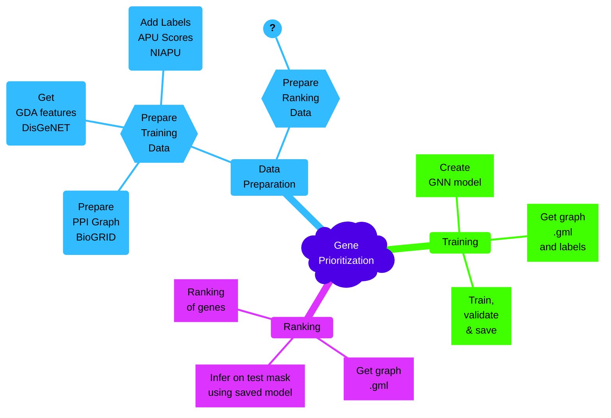
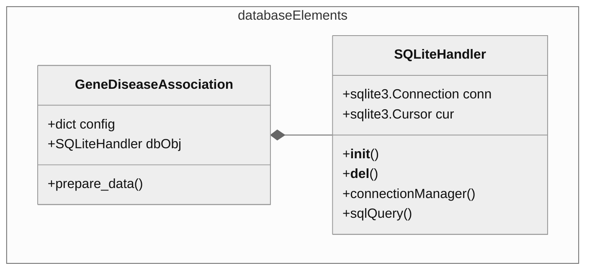
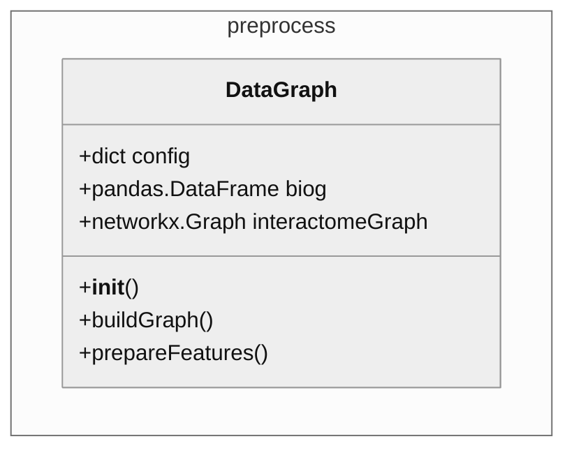
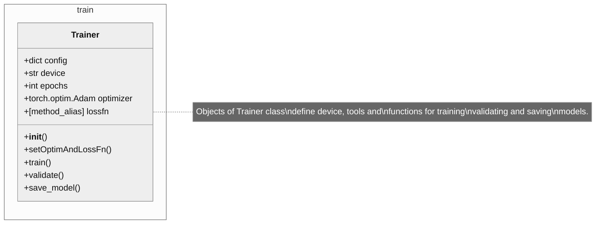
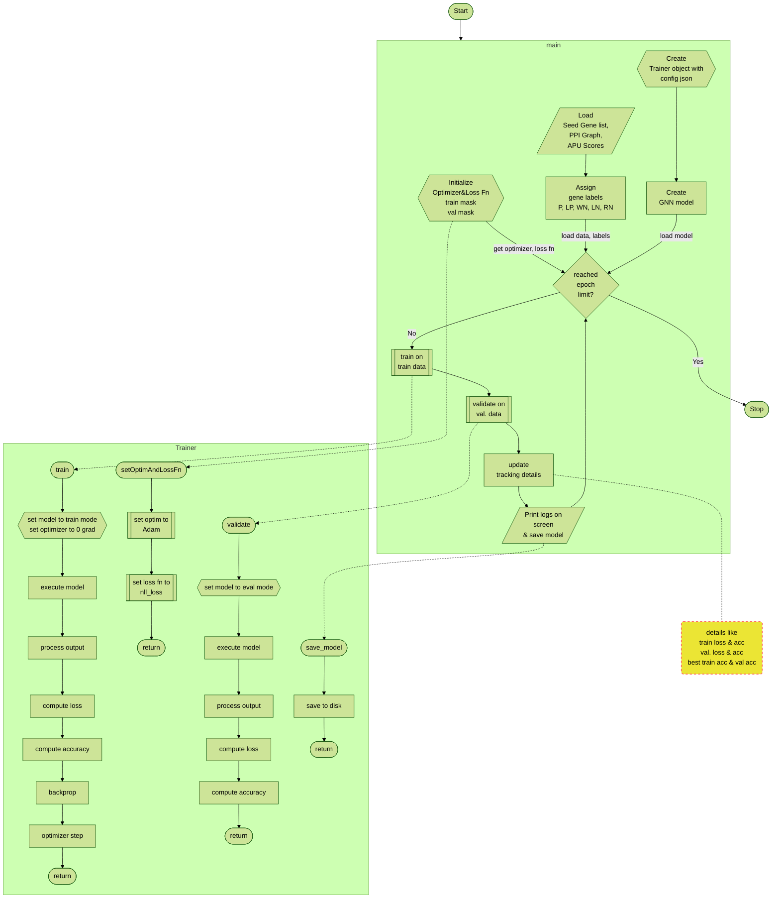
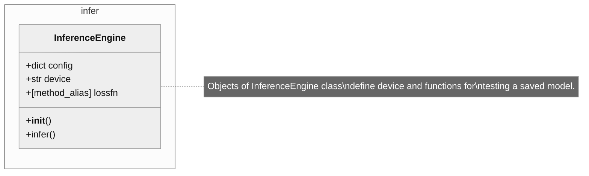
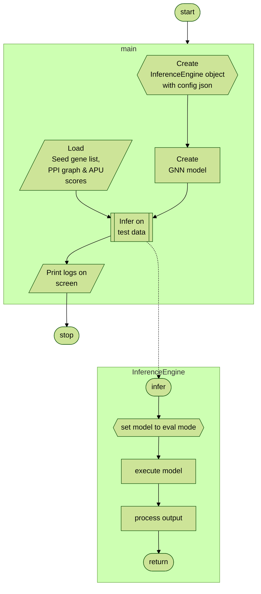
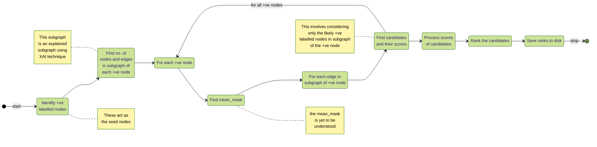

# Developer Notes

## Table of Contents
1. [Directory Structure](#directory-structure)
2. [An Overview of Modules](#an-overview-of-modules)
3. [Data Preparation Module](#data-preparation-module)
    1. [Training Data Preparation](#training-data-preparation)
    2. [Ranking Data Preparation](#ranking-data-preparation)
4. [Training Module](#training-module)
5. [Inference Module](#inference-module)
6. [Ranking Module](#ranking-module)

## Directory Structure
[back to contents](#table-of-contents)

The directory structures that follows, depicts the files that are essential to the working of the project. There are other files in the repository, that have been ommitted for clarity.
```console
.
├── data
│   ├── all_gene_disease_associations.tsv
│   ├── APU_scores
│   │   ├── C0006142_Malignant_neoplasm_of_breast_features_Score.csv
│   │   └── README.md
│   ├── DataGraphs
│   │   ├── grafo_nedbit_C0006142.gml
│   │   └── README.md
│   ├── Graphs
│   │   ├── C0006142_nedbit.gml
│   │   └── README.md
│   ├── Models
│   │   ├── GNN7L_SAGEConv_saved_07May2024_65_LR0015.pt
│   │   └── README.md
│   ├── NeDBIT_features
│   │   ├── C0006142_Malignant_neoplasm_of_breast_features
│   │   └── README.md
│   ├── NeDBIT_features.zip
│   ├── Rankings
│   │   ├── C0006142_ranks.csv
│   │   └── README.md
│   ├── README.md
│   └── seed_genes
│       ├── C0006142_Malignant_neoplasm_of_breast_all_seed_genes.txt
│       └── README.md
├── docs
│   ├── Developer_Guide.md
│   ├── Project_Design.md
│   └── README.md
├── LICENSE
├── README.md
├── requirements.txt
└── scripts
    ├── configFiles
    │   ├── preproc_config.json
    │   ├── rank_config.json
    │   └── train_config.json
    ├── generate_ranks.py
    ├── infer.py
    ├── __init__.py
    ├── model
    │   ├── __init__.py
    │   └── model.py
    ├── preprocess.py
    ├── train.py
    └── utils
        ├── databaseElements.py
        ├── dataclass.py
        ├── generate_pipeline.py
        ├── helpers.py
        └── __init__.py
```
The project runs in multiple stages, viz., **Data Preparation**, **Training**, **Ranking**.
The specific starting point of these steps are `scripts/preprocess.py`, `scripts/train.py` and `scripts/generate_ranks.py` respectively.

## An Overview of Modules
[back to contents](#table-of-contents)

Think of the modules as related to each other as follows:

As may be observed from the above _mindmap_ that the sub-steps for preparing the the Ranking module's input data is not yet clear. In the present version of the repository, the input data has been borrowed from the **XGDAG** official repository.

## Data Preparation Module
[back to contents](#table-of-contents)

### Training Data Preparation
[back to contents](#table-of-contents)

The logic for Data Preprocessing is contained within the file(s) `scripts/preprocess.py` and `scripts/utils/databaseElements.py`.

The **DisGeNET** data is available from the official website as an SQLite (`.db`) file. The extraction of relevant information from this SQLite file into a `.tsv` (`.csv`) file is accomplished by the **GeneDiseaseAssociation** and **SQLiteHandler** classes in the `scripts/utils/databaseElements.py` file.

```python
def buildGraph(self):
    ...
```
As a second part of data pre-processing, it was expected that the `.tsv` file created above will be used to prepare the node features and labels (via the **TSVParser** class of `scripts/preprocess.py`). This however, _could not be achieved_ since the processes involved were not clear till the time of this commit.

As an alternative, the requisite file, `/data/NeDBIT_features/C0006142_Malignant_neoplasm_of_breast_features` was borrowed from the NIAPU repository of the author(s). 


The steps of the second part of data pre-processing are as follows [`buildGraph()`]:
1. Load the **BioGRID** sourced protein-protein interactome (PPI) data file (`.tsv`)
2. Filter out non human interactomes and self-loops
3. Retain only the largest connected components
4. Save to disk


```python
def prepareFeatures(self):
    ...
```
To prepare the node features, the **DisGeNET** sourced data needs to be mapped to the graph created above; in our case, the features could not be computed as the recipes weren't entirely clear. Instead, the requisite values were imported from the NIAPU repository by the author(s) of the XGDAG paper!

The following steps summarize the mapping process:
1. Load the PPI graph
2. Read in the feature file `/data/NeDBIT_features/C0006142_Malignant_neoplasm_of_breast_features` (`.tsv`)
3. To each node of the graph, features assigned are: _degree_, _ring_, _NetRank_, _NetShort_, _HeatDiff_, _InfoDiff_
4. The feature values are normalized using the **RobustScaler** class from the **sklear** package
```python
nf = pd.read_csv(self.config["projRootPath"] + "/data/NeDBIT_features/C0006142_Malignant_neoplasm_of_breast_features")
...
...
```

The last step is to attach the output labels [_P_, _LP_, _WN_, _LN_, _RN_] to each node.
Again, the labels were generated within the NIAPU repository and the process wasn't entirely clear - so we borrow:
1. Load the APU scores' `.csv` file from `/data/APU_scores/C0006142_Malignant_neoplasm_of_breast_features_Score.csv`
2. The file provides the label for each node/gene by its **ID**, so mapping is straight forward!
```python
scores = pd.read_csv(self.config["projRootPath"] + "/data/APU_scores/C0006142_Malignant_neoplasm_of_breast_features_Score.csv", dtype=datatypes)

scores = dict(zip(scores['name'], scores['out']))

for node in self.interactomeGraph:
    self.interactomeGraph.nodes[node]['score'] = scores[node]
```

Finally, save the PPI graph (now with features and labels) to disk.

### Ranking Data Preparation
[back to contents](#table-of-contents)

Further, the **Data Preparation Module** was also supposed to handle the preparation of the input data for the **Ranking Module**, however, the procedure for creating the data was not clear. As before, we merely copied the requisite data from the NIAPU repository provided by the author(s).

## Training Module
[back to contents](#table-of-contents)


The file `scripts/train.py` is a **standalone python script** used in this project, to train a (_GNN_) model, validate them and save its parameters/state.

The major steps followed in the file may be summarized by the following flowchart:

The exact starting point of any standalone Python script is:
```python
if __name__ == '__main__':
    # do something
```
In this case that is the `main()` method. The `main()` method performs the following steps:
1. Load the train configuration file
```python
cfgFile = str(Path(__file__).parent.absolute() / "configFiles/train_config.json")
```
2. Create a `Trainer` class object
```python
DLobj = Trainer(cfgFile)
```
3. Set the compute device
4. Load the graph (_which also loads node features and labels_): (**[data loader explanation](util_Developer_Guide.md#dataclasspy-explained)**)
```python
data, _ = getData(cfgFile, dataGraph_filename)
```
5. Transfer everything to preferred compute device
6. Create the model object: (**[model explanation](model_Developer_Guide.md#description-of-gnn-model)**)
```python
model = GNN7L_SAGEConv(
    in_features=data.num_features,
    out_classes=data.num_classes
).to(Trainer.device)
```
7. Set the optimizer and loss function for the training procedure
8. Prepare the _access_ to the data (single graph, thus, train mask and validation mask), and other tracking variables

The tracking variables (_here initialized to zero_):
```python
best_train_acc = torch.tensor([0]).to(Trainer.device)
best_val_acc = torch.tensor([0]).to(Trainer.device)
best_train_lss = torch.tensor([999]).to(Trainer.device)
best_loss_epoch = torch.tensor([0]).to(Trainer.device)
```
store the best accuracy and minimum loss values over the epochs; this information is used for logging and model saving purpose later.

9. The actual train-validate cycle is as follows:
    1. The training loop is started for `epochs` no. of times

    ```python
    for e in range(DLobj.epochs+1):
        # logic
    ```
    2. Trainer class' `train()` and `validate()` methods are invoked with the **model**, **data** (_PPI graph_), (_node_) **labels** and respective masks [**train_mask** and **label_mask**]
    3. The training loss and accuracy as well as validation loss and accuracy are tracked along with the best performance over all epochs.
    4. Logs are printed to the screen and best performing models saved to disk over regular schedule.

The `train()` and `validate()` methods perform straight-forward tasks, as depicted in the flowchart above.

## Inference Module
[back to contents](#table-of-contents)


The file `scripts/infer.py` is a standalone python script used in this project, to test a saved (GNN) model. Further, the `InferenceEngine` class is used as a sub-module in the ranking module!

The major steps followed in the file may be summarized by the following flowchart:

The exact starting point of any standalone Python script is:
```python
if __name__ == '__main__'
    # do somthing
```
However, the `scripts/infer.py` file is designed more as a module (especially the `InferenceEngine` class) to be invoked from a different method that to be run as a standalone script.

That said, this file can be used to quickly verify the performance of the _trained_ model.

## Ranking Module
[back to contents](#table-of-contents)

The **ranking module** does most of the heavy lifting in this project. The main steps followed in the file may be summarised in the following flowchart:

```mermaid
%%{init: {'theme': 'forest', 'maxTextSize': 6000}}%%
flowchart TB
    direction TB

	p0([start])
    p1[[InferenceEngine]]
	pn([stop])
	
    subgraph main
        direction TB

        m1[/Load Seed gene list,<br/>PPI graph & APU scores/]
        m2[[Create GNN model object<br/>& load saved model]]
        m3[[Generate model predi-<br/>-ctions on test data]]
        m4[[Generate ranked<br/> gene list]]
        m5[save ranked<br/>gene list to disk]

        m1 --> m2
        m2 --> m3
        m3 --> m4
        m4 --> m5
    end

    subgraph ranker["predict_candidate_genes_gnn_explainer_only()"]
        direction TB

        r1{{declare variables<br/>for ranking}}
        r2{unvisited<br/>node in<br/>graph?}
        r3{node<br/>labelled<br/>+ve?}
        r4[add node to<br/>nodes_with_idxs<br/>add idx]
        r5[/print node count/]

        r1 --> r2
        r2 -->|Yes| r3
        r2 -->|No| r5
        r3 -->|Yes| r4
        r3 -->|No| r2
        r4 --> r2

        r6{unvisited<br/>node in<br/>nodes_with_idxs?}
        r7[for +ve node, find<br/>1-hop sub graph]
        r8{this +ve node in<br/>subg_numnodes_d?}
        r9[in dict subg_numnodes_d<br/>save sub graph vertex<br/>and edge count]
        r10[clear temp vars]

        r5 --> r6
        r6 -->|Yes| r7
        r6 -->|No| r10
        r7 --> r8
        r8 -->|Yes| r9
        r8 -->|No| r6
        r9 --> r6

        r11{unvisited<br/>+ve node in<br/>nodes_with_idxs?}
        r12[initialize mean_mask to 0<br/>init candidate dict for +ve node]
        r13{iterator<br/>over masks_for_seed<br/>exhausted?}
        r14[[create GNNExplainer object]]
        r15[[create explainer object]]
        r16[[generate explanation for<br/>model over test data graph]]
        r17[add explanation object's<br/>edge_mask var to mean_mask]
        r18[clear temp vars]
        r19[compute average mean_mask<br/>over masks_for_seed]
        r19_1[compute num_nodes, the subgraph vertex threshold]

        r10 --> r11
        r11 -->|Yes| r12
        r12 --> r13
        r13 -->|No| r14
        r13 -->|Yes| r19
        r14 --> r15
        r15 --> r16
        r16 --> r17
        r17 --> r18
        r18 --> r13

        r20[filter mean_mask to<br/>hard_mean_mask based on average val]
        r21[copy into values from mean_mask<br/>where hard_mean_mask is 1]
        r22[copy into indices, non zero<br/>values of  hard_mean_mask]
        r23{{clear temp variables<br/>init seen_genes}}
        
        r19 --> r19_1
        r19_1 --> r20
        r20 --> r21
        r21 --> r22
        r22 --> r23
        r23 --> r24

        r24{iterator<br/>over indices<br/>exhausted?}
        r25[identify src, trgt from edge_index, using indices]
        r27[get src_name, trgt_name from<br/>nodes_names using src, trgt respectively]
        r28[get prediction for src node and trgt node]

        r29{is<br/>src_name same as<br/>+ve node?}
        r30[add src_name to seen_genes]
        r31{is<br/>trgt_name same as<br/>+ve node?}
        r32[add trgt_name to seen_genes]

        r33{does<br/>src_pred indicate<br/>LP?}
        r33_1{is src_name<br/>already in candidate dict for<br/>current +ve node?}
        r33_2[assign from values, current<br/>indexed item to candidate dict for<br/>the +ve node's src_name sub dict]
        r33_3[add current indexed values<br/>to candidate dict for the +ve<br/>node's src_name sub dict]
        
        r34{does<br/>trgt_pred indicate<br/>LP?}
        r34_1{is trgt_name<br/>already in candidate dict for<br/>current +ve node?}
        r34_2[assign from values, current<br/>indexed item to candidate dict<br/>for the +ve node's trgt_name sub dict]
        r34_3[add current indexed values<br/>to candidate dict for the +ve<br/>node's trgt_name sub dict]
        r35{does<br/>seen_genes count exceed<br/>num_nodes?}
        r36[increment nodes_explained by 1]

        r24 -->|No| r25
        r25 --> r27
        r27 --> r28
        r28 --> r29
        r29 -->|Yes| r30
        r29 -->|No| r31
        r30 --> r31
        r31 -->|Yes| r32
        r31 -->|No| r33
        r32 --> r33

        r33 -->|Yes| r33_1
        r33 -->|No| r34
        r33_1 -->|Yes| r33_2
        r33_1 -->|No| r33_3
        r33_2 --> r34
        r33_3 --> r34

        r34 -->|Yes| r34_1
        r34 -->|No| r35
        r34_1 -->|Yes| r34_2
        r34_1 -->|No| r34_3
        r34_2 --> r35
        r34_3 --> r35

        r35 -->|Yes| r36
        r35 -->|No| r24
        r36 ---> r11

        r37{iterator var<br/>seed, over first level of nested dict<br/>candidates, exhausted?}
        r37_1{iterator<br/>var candidate, over dict seed,<br/>exhausted?}
        r37_2{is candidate in ranking?}
        r37_3[assign tuple 1,<br/>filtered edge_mask value from<br/>candidates, seed]
        r37_4[add correspondingly,<br/>1, filtered edge_mask value from<br/>candidates, seed]

        r38[[create dataframe from the ranking dict]]
        r39[[sort the dataframe on<br/>filtered edge_mask value from candidates,<br/>occurence count]]
        r40([return])

        r11 -->|No| r37
        r37 -->|No| r37_1
        r37 -->|Yes| r38
        r37_1 -->|No| r37_2
        r37_1 -->|Yes| r37
        r37_2 -->|Yes| r37_3
        r37_2 -->|No| r37_4
        r37_3 --> r37_1
        r37_4 --> r37_1

        r38 --> r39
        r39 --> r40
    end

    p0 ---> m1
    m2 -...-> p1
    m3 -...-> p1
    m4 -...-> r1
    m5 --> pn
    
```


The ranking module ustilises the classes `Explainer` & `GNNExplainer` from `torch_geometric.explain` package for generating the **explanations** for the subgraphs of the positive nodes. The general idea of the functions `predict_candidate_genes_gnn_explainer_only()` may be captured in the following state diagram:


Further explanation for the entire ranking module may be understood from the [source code](https://github.com/GiDeCarlo/XGDAG/blob/fdfeb7e370a4bce2ec8bec698c57e0d91dfc41a9/GDARanking.py#L220) and the _original publication_ [XGDAG: explainable gene–disease associations via graph neural networks](https://academic.oup.com/bioinformatics/article/39/8/btad482/7235567).