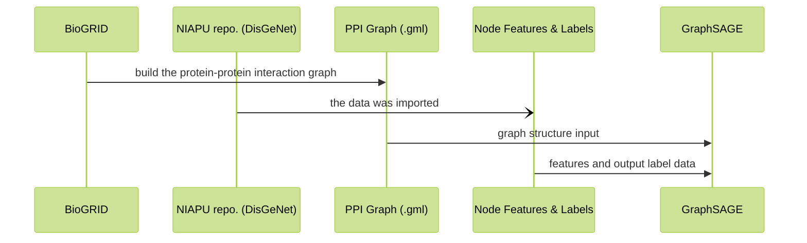
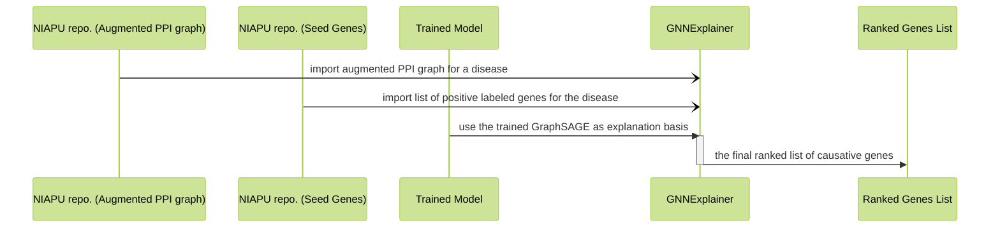
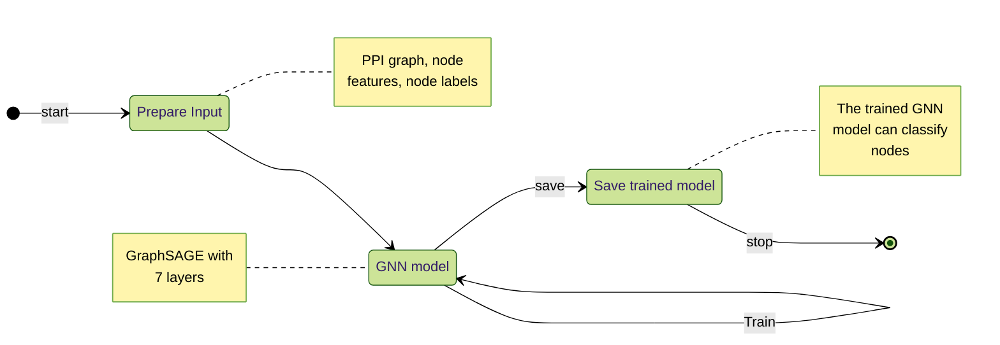
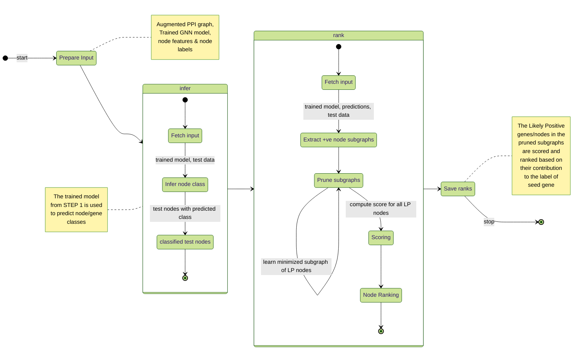

filename## Table of Contents
1. [Table of Figures](#table-of-contents)
2. [Table of Tables](#table-of-contents)
3. [Revision History](#revision-history)
4. [Review History](#review-history)
5. [Executive Summary](#executive-summary)
    1. [Document Overview](#document-overview)
    2. [Purpose and Scope of this Document](#purpose-and-scope-of-this-document)
    3. [Acronyms](#acronyms)
    4. [Glossary](#glossary)
6. [Product/Service Description](#productservice-description)
    1. [Product Context](#product-context)
    2. [Product Characteristics](#product-characteristics)
    3. [Constraints](#constraints)
    4. [Dependencies](#dependencies)
7. [Requirements](#table-of-contents)
    1. [Functional Requirements](#table-of-contents)
    2. [Process Requirements](#table-of-contents)
    3. [Performance Requirements](#table-of-contents)
    4. [Evaluation Requirements](#table-of-contents)
    5. [Standard Compliance, Qualification and Certifications Requirements](#table-of-contents)
    6. [Build Requirements Requirements](#table-of-contents)
    7. [IP Protection Requirements](#table-of-contents)
    8. [Documentation Requirements](#table-of-contents)
8. [Collateral Requirements](#table-of-contents)
    1. [Marketing Communications and Product Launch Requirements](#table-of-contents)
    2. [Productization Collateral Requirements](#table-of-contents)
    3. [System Interface Requirements](#table-of-contents)
    4. [Reliability Requirements](#table-of-contents)
    5. [Security Requirements](#table-of-contents)
9. [User Scenarios/Use Cases](#table-of-contents)
10. [Deferred Requirements](#table-of-contents)

## Revision History
[back to contents](#table-of-contents)

| Revision No. | Version No. | Date | Author(s) | Brief Description of changes | Review Status | Review Date | Reviewer(s) |
| :--: | :--: | :--: | :--: | :--- | :--: | :--: | :--: |
|1.|0.1|06/May/2024|Anurag Banerjee|First draft of the document| `Pending` |06/May/2024|Gorantla E J Lakshmi Narayana|

## Review History
[back to contents](#table-of-contents)

| Review No. | Version No. | Date of Review | Reviewer(s) | Reviewer Recommendation | Comments | Comment Action Status/Date |
| :--: | :--: | :--: | :--: | :--: | :--- | :--: |
|1.|0.1|--|Gorantla E J Lakshmi Narayana|--|--|`Pending` as on 06/May/2024|

## Executive Summary

### Document Overview
[back to contents](#table-of-contents)

The purpose of this workshop was to understand the concept presented in the paper, titled "_XGDAG: explainable gene–disease associations via graph neural networks_". The approach adopted was as follows: re-implement the logic (with code re-use in mind) presented by the Author(s) of the paper to recreate their result.

### Purpose and Scope of this Document
[back to contents](#table-of-contents)

This document provides an overview for the code that was developed as part of the workshop. Whereas within this document a very high level overview shall be presented, more detailed description shall be part of the developer documentation.

This document shall provide a high level workflow of the entire logic that forms the core of the paper.

### Acronyms
[back to contents](#table-of-contents)

`XGDAG` : e**X**plainable **G**ene-**D**isease **A**ssociation via **G**raph Neural Networks

`NIAPU`: **N**etwork-**I**nformed **A**daptive **P**ositive-**U**nlabeled learning for disease genes identification

`GNN`: **G**raph **N**eural **N**etwork

### Glossary
[back to contents](#table-of-contents)

_Gene-Prioritization_: Ranking human genes on the basis of how probable they are to cause a disease.

## Product/Service Description
[back to contents](#table-of-contents)

The paper XGDAG aims at generating a ranked list of human genes; wherein the basis of ranking is the causative probability for a disease. This enables the life sciences community to target the genes in order to prepare cures.

To achieve the aforementioned objective, the workflow followed was as follows:

The GraphSAGE is a 7 layer GNN model, that is trained to classify the nodes (_genes_) in the graph into one of the 5 classes, viz., _Positive_, _Likely Positive_, _Weakly Negative_, _Likely Negative_, _Reliably Negative_; where the positivity or negativity relates to the likelyhood of the gene causing a disease.

It is to be noted that the **DisGeNet** data is per disease!

Once the GNN model is trained for a particular disease, next the ranking logic is executed:

The idea of the ranking algorithm is as follows: 
1. for each **seed gene** which is essentially a positively labeled gene (_causes the disease_), find a subgraph from the PPI graph
    1. GNNExplainer takes in a graph input, the output labels and finds the smallest possible subgraph (and sub-feature set) that resulted in the output labels (_thus called explanation_)
    2. in the PPI subgraph thus obtained, retain only the _Likely Positive_ genes/nodes
2. Using a threshold, the size of the subgraph thus obtained is maintained
3. In a global storage, the genes part of the subgraph above are assigned a score
4. Genes that form a part maximum number of such subgraphs are going to be ranked higher

#### The entire process may be depicted via the following two state diagrams:
[back to contents](#table-of-contents)

STEP 1: **GNN Training**

STEP 2: **Gene Ranking**

### Product Context
[back to contents](#table-of-contents)

This repository aims at recreating the results (gene rankings) as reported by the authors such that the process by which it was obtained may be understood and improved upon.

The aim of such a means and mechanism is that once we have a reliable list of genes ranks for a disease, curative research may be undertaken with the high ranking genes as targets.

### Product Characteristics
[back to contents](#table-of-contents)

The program/algorithm created as part of this workshop has the following characteristics:
1. It is a Python script that relies on PyTorch and various other related libraries
2. Currently available only as a primitive, terminal based, python executable
3. Shows the working of the entire pipeline for only **1** disease

### Constraints
[back to contents](#table-of-contents)

The repository created under this workshop faces the following constraints:
1. The input data for the GNN module as well as the ranking module is not yet well understood
2. The GNN training as well as the ranking has to be run separately for each disease
3. The ranking algorithm is an immensely time consuming routine
4. The **validity** or **correctness** of the generated ranks cannot be verified!

### Dependencies
[back to contents](#table-of-contents)

The repository created under this workshop has following dependancies:
1. Currently depends on the data provided by the authors of the paper.
2. The execution time and hence time to generate results depends on the inhouse compute power